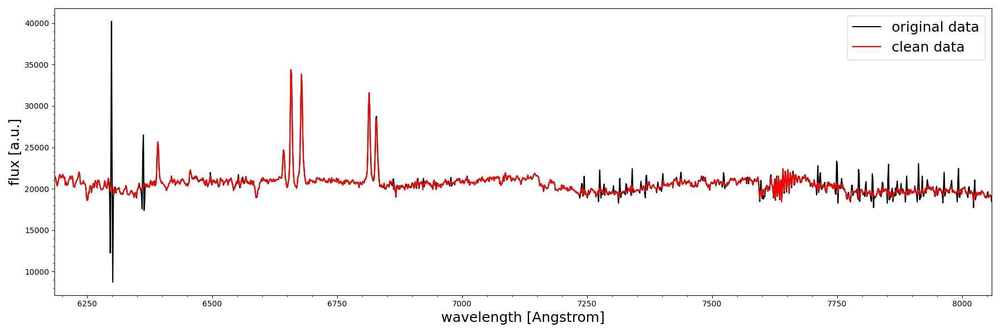
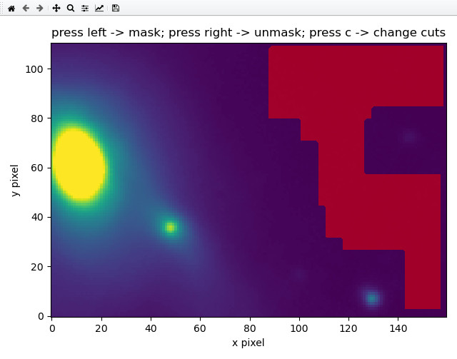

# CubePCA Package

This is a simple package for cleaning astronomical IFU osbservations from sky line residuals or any systematic artefacts. 
It has been developed mainly for VLT/MUSE optical IFU data, but can also be applied to similar data sets. 
The software provides 4 command-line tools to performs the necessary tasks:
* `createPCAsky.py` to create PCA component spectra
* `applyPCAsky.py` to clean a cube using the PCA component spectra
* `subtractPCAsky.py` which combines both step into a single command
* `createMask.py` which allows to visually set spatial masks to determine sky regions for PCA analysis   

A common sequence of commands would be as follows 
1. `createPCAsky.py DATACUBE_IN.fits PCA_LIBRARY_OUT.fits SKY_MASK.fits --verbose` 
2. `applyPCAsky.py DATACUBE_IN.fits DATACUBE_CLEAN.fits PCA_LIBRARY_OUT.fits -m WAVE_MASK.txt --verbose`

There are a few more parameters available for each command to control the process. Please use `-h` option for more details. 
In most cases the default parameter should be sufficient at least in case of VLT/MUSE observations. 

A SKY_MASK.fits file has to be created either manually or automatically which needs to have the same
spatial dimensions as the input data cube. Regions to be considered as pure sky for the PCA analysis 
need to set to 1 and others to 0. 

A data set is provided in the example folder together with the bash script `run_commands.sh`  which can be run as `bash run_commands.sh`.
It consists of two commands with parameters matched for the example case. It also shows the use of the `wave_mask.txt` which sets wavelength
regions in which residuals should be subtracted while keeping the rest of the wavelength range unchanged. The effective ness of the PCA cleanning is shown below

A sky mask region file as `SKY_mask.fits` in the example which can be visualized and change using the command `createMask.py MUSE_example.fits.gz SKY_mask.fits -e 0`
Which opens a matplotlib windows in which rectangular regions can be added/removed with the mouse interactively. Intensity scaling
can be changed by pressing c on the keyboard and the x and y axis range can be changed by pressing x and y on the keyboard.

  

